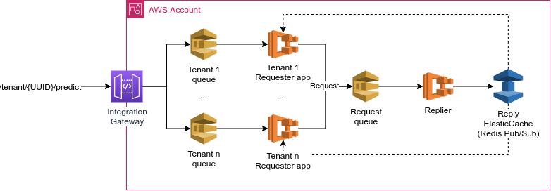
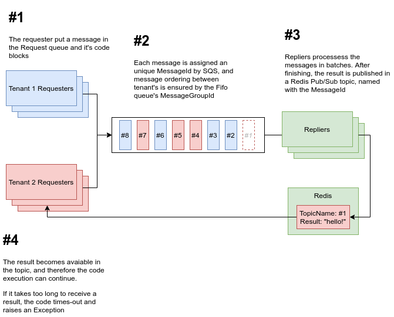

# Async request-reply prototype

A simple prototype for a multi-tenancy, async request/reply system, as shown in the figure:



To avoid AWS expenses we run both the Requester and Replier applications locally.
ElasticCache also have been replaced by [Redis running in Docker](https://hub.docker.com/_/redis).

**Attention:** this architecture is a prototype and was developed as a study-case only. It haven't been stressed yet.

## How it works



## How to run the prototype

### Infrastructure

- Create a *terraform.tfvars* file containing the tenants id as follows:
```terraform
tenants = [
  "97fbac68-fe8e-4495-99d4-27e4163c405d",
  "5bdd5391-d2b9-41d5-98ad-d6c18f30e21c"
]
```
- Run *terraform apply*.
- Access SQS Console and get the *requests-queue.fifo* URL.

### Code

- Create a virtual-env and install the requirements listed in *requirements.txt*
- Open two terminals; one for running the Requester application and another one for the Replier.
- Before executing the code, export the Queue URL as follows:
```shell
export QUEUE_URL=''
```